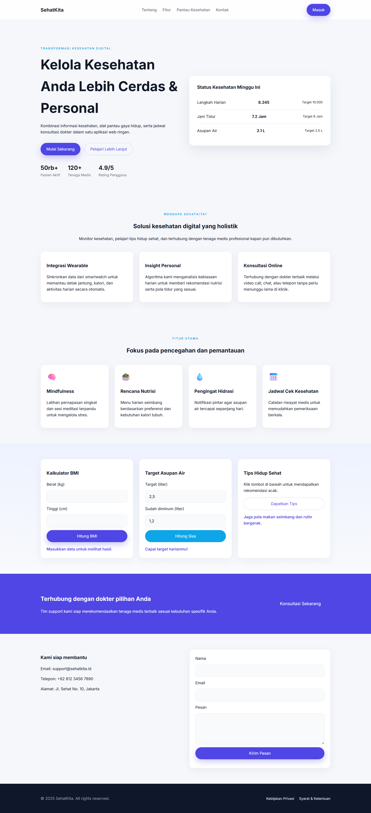

# 🩺 SehatKita - Aplikasi Kesehatan Digital Holistik

## 📝 Deskripsi Proyek

**SehatKita** adalah *landing page* aplikasi web yang dirancang untuk membantu pengguna mengelola kesehatan mereka secara lebih cerdas dan personal. Aplikasi ini berfokus pada pencegahan dan pemantauan gaya hidup melalui integrasi alat kesehatan dasar (Kalkulator BMI, Monitor Hidrasi) dan jalur konsultasi online.

Proyek ini dibangun menggunakan **HTML**, **CSS** (Native/Vanilla), dan **JavaScript** (Native), dengan penekanan pada desain yang responsif dan *user-friendly*.

***

## ✨ Fitur Utama

* **Integrasi Pemantauan:** Kalkulator BMI interaktif dan Monitor Hidrasi *real-time*.
* **Aksi Cepat:** Tombol CTA (Call to Action) yang mengarahkan ke formulir kontak dan konsultasi.
* **Informasi Dinamis:** Menampilkan tips kesehatan acak menggunakan fungsi JavaScript.
* **Desain Responsif:** Memastikan tampilan optimal di berbagai ukuran layar (*desktop* dan *mobile*).

***

## 📸 Tangkapan Layar Aplikasi

Berikut adalah tampilan antarmuka (screenshot) aplikasi web SehatKita yang sudah di-*embed* dari repositori ini:

***

## 🎨 Tautan Desain & Flow

Proyek ini dikembangkan berdasarkan spesifikasi desain dan alur pengguna berikut (pastikan tautan dapat diakses secara publik):

| Tipe Desain | Tautan Figma |
| :--- | :--- |
| **User Flow (Alur Pengguna)** | [Link Flow Figma](https://www.figma.com/board/IVMc7BKyoyaxsAbkhYXaPP/Untitled?node-id=0-1&t=eWcTpdjYogkPQpRU-1) |
| **Visual Design (Desain UI/UX)** | [Link Desain Figma](https://www.figma.com/design/QTFMv8wbc9B8cWFWFOHnBB/desain-web-uts?t=eWcTpdjYogkPQpRU-1) |
